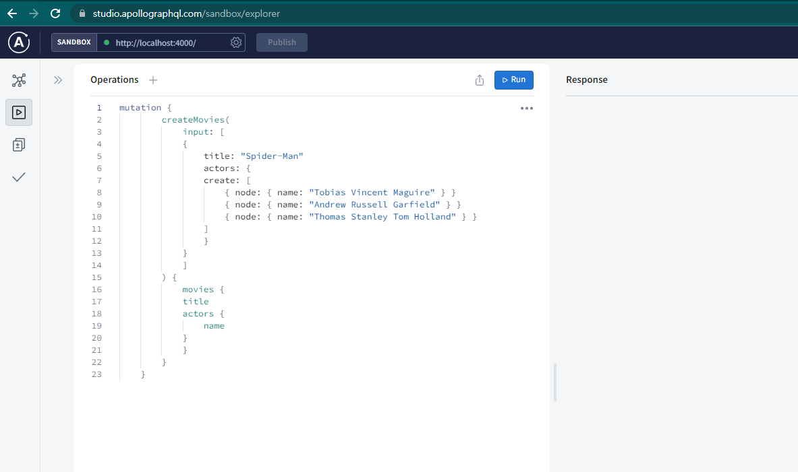
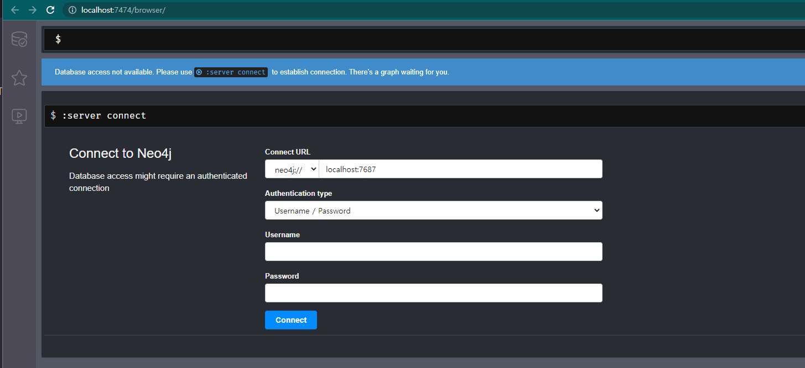
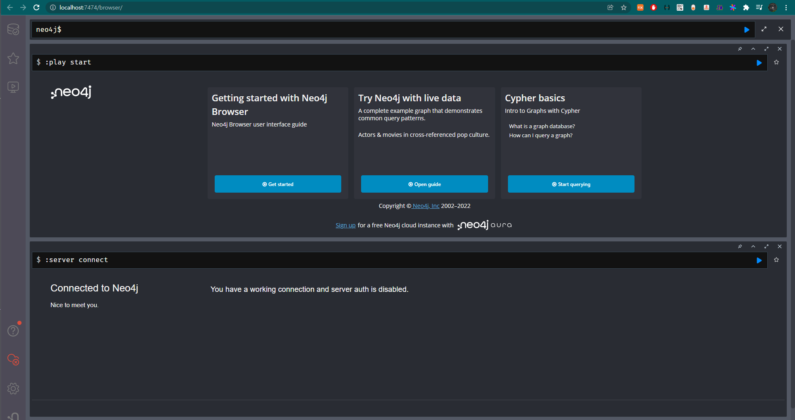
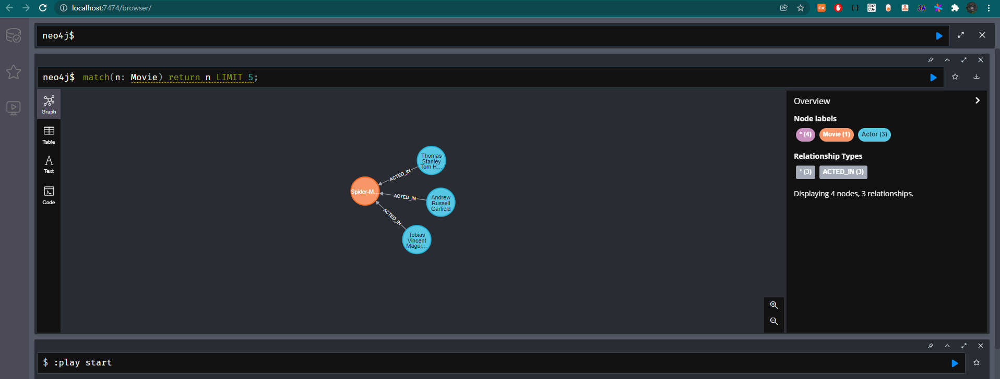

# neo4j-practice

## setup

```bash
docker compose up -d
cd neo4j-graphql-example && npm i && node index.js
```

### apollographql 접속

http://localhost:4000 으로 접속 후 초기 데이터 추가



### neo4j browser로 데이터 확인

http://localhost:7474/browser/ 접속

참고: [neo4j/graph-visualization](https://neo4j.com/developer/graph-visualization/)

#### 접속화면



#### 로그인 후



#### 그래프 입력 후

